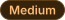

# severity-chips

Severity badges for automated PR review comments. Two SVGs per severity — a
light and a dark variant — embedded with `<picture>` so GitHub swaps them with
the reader's theme.

| Severity | Light | Dark |
| --- | --- | --- |
| Major |  |  |
| Medium |  |  |
| Minor |  |  |

Glyphs are baked to paths (Inter SemiBold, 12px), so the badge renders
identically wherever it is proxied, with no font dependency.

## Usage

```html
<a><picture><source media="(prefers-color-scheme: dark)" srcset="https://raw.githubusercontent.com/ssivov/severity-chips/main/major_dark.svg"><source media="(prefers-color-scheme: light)" srcset="https://raw.githubusercontent.com/ssivov/severity-chips/main/major_light.svg"></picture></a>
```
